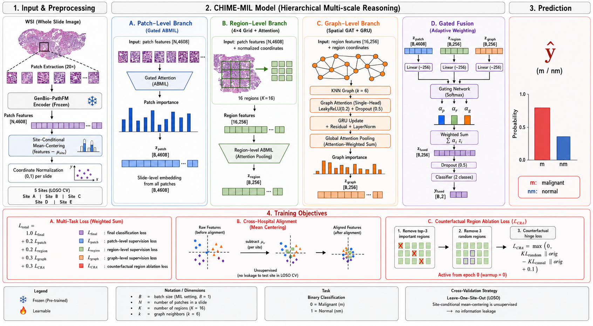

# CHIME-MIL (GenBio): Cross-Hospital Robust Tumor-vs-Normal WSI Classification

[](https://github.com/VanchhayNheng/CHIME-MIL) [](https://github.com/VanchhayNheng/CHIME-MIL/blob/main/LICENSE)

Reference implementation of CHIME-MIL with **GenBio-PathFM** features for
5-fold leave-one-site-out (LOSO) tumor-vs-normal classification across
**5,036 whole-slide images from five hospitals**.

**Headline result:** mc_sa @ (256+392) flat-fuse — **AUC 0.8434**
(5-fold LOSO mean), beating the UNI Top-4 ensemble baseline at AUC 0.8346.



*Overview of CHIME-MIL: per-slide patches -> frozen GenBio-PathFM features -> site-conditional mean-centering, then hierarchical patch / region / graph branches with gated fusion and auditable attention; trained 5-fold leave-one-site-out across Sites A-E.*

## Table of contents

- [Setup](#setup)
- [Data layout](#data-layout)
- [Reproduce the headline result](#reproduce-the-headline-result)
- [Reproduce the ablation chain](#reproduce-the-ablation-chain)
- [Repo layout](#repo-layout)
- [Citation](#citation)

## Setup

```bash
# Python 3.10 with a CUDA-enabled PyTorch build.
pip install -r requirements.txt
```

All commands below assume they are run **from the repository root**. Data paths
in `configs/*.yaml` use a `/path/to/data` placeholder — edit them to point at
your own data root before running. The training launchers (`scripts/run_*.sh`)
default to `PY=python3` and a repo-relative `REPO=.`; override `PY`/`REPO` if
your environment differs.

## Data layout

The 5,036 WSIs span five anonymized sites, **Site_A … Site_E** (one per
leave-one-site-out fold, 1–5). Site assignment is inferred from slide-ID
prefixes (`dataset_meancenter.infer_hospital`); the released code emits site
labels as `Site_A`…`Site_E` only. Point the `configs/*.yaml` keys at a data root
laid out as:

```
/path/to/data/
├── GENBIO_PATHFM_FEATURES/      # 256-px GenBio-PathFM features  (feature_dir)
│   └── h5_files/<slide_id>.h5
├── GENBIO_PATHFM_FEATURES_392/  # 392-px features (configs/config_genbio_392.yaml)
│   └── h5_files/<slide_id>.h5
└── dataset_csv/                 # label metadata (csv_dir)
    └── tumor_vs_normal_dummy_clean.csv   # columns: slide_id, label
```

## Reproduce the headline result

The headline AUC = 0.8434 is **flat-fusion of mc_sa@256 and mc_sa@392
predictions**:

```bash
# 1+2. Deterministic re-run: mc_sa @256 (GPU1) + @392 (GPU3), 5 folds each.
#      Pins PYTHONHASHSEED=42 + CUBLAS_WORKSPACE_CONFIG for a stable val split.
bash scripts/rerun_headline_2gpu.sh
#   -> results/rerun/mc_sa_256/fold_*/result.json  (5-fold mean AUC 0.8341)
#   -> results/rerun/mc_sa_392/fold_*/result.json  (5-fold mean AUC 0.8326)

# 3. Flat-fuse the two prediction tracks (per-fold-mean headline)
python fusion/late_fusion_256_392.py \
  --pred_dir_256 results/rerun/mc_sa_256 \
  --pred_dir_392 results/rerun/mc_sa_392
#   -> Mean fused AUC = 0.8434  (gain +0.0092 over best single-scale -> ESCALATE)

# 4. Pooled-LOSO bootstrap CI + paired significance test
python fusion/fused_headline_ci.py \
  --pred_dir_256 results/rerun/mc_sa_256 \
  --pred_dir_392 results/rerun/mc_sa_392 --n_boot 10000 --seed 42
#   -> fused pooled 0.8174 [0.8047, 0.8295]; fused-best paired +0.0088 [+0.0048, +0.0127], p<0.0001
```

## Reproduce the ablation chain

Deterministic re-run (PYTHONHASHSEED=42 + CUBLAS_WORKSPACE_CONFIG, md5 val split),
5-fold LOSO mean test AUC. Every row uses the same grid `CHIME_MIL` model — the
old "soft_assign" row is actually a hospital-stratified validation split, not soft
assignment (see docs/ARCHITECTURE.md).

| Variant                                      | Trainer                            | Mean AUC |
|----------------------------------------------|------------------------------------|---------:|
| Baseline                                     | train_loso_genbio.py               | 0.8204   |
| meancenter                                   | train_loso_meancenter_genbio.py    | 0.8274   |
| stratified-val                               | train_loso_sa_genbio.py            | 0.8222   |
| **meancenter + stratified-val (mc_sa @256)** | train_loso_mc_sa_genbio.py         | **0.8341** |
| e09 patch-only                               | train_loso_e09_genbio.py           | 0.8196   |
| **mc_sa @ (256+392) flat-fuse**              | fusion/late_fusion_256_392.py      | **0.8434** |

Single-fold smoke (Site A held out):

```bash
python train_loso_mc_sa_genbio.py \
  --config configs/config_genbio.yaml \
  --hospitals Site_A \
  --output_dir results/smoke_mc_sa_site_a
```

All 5 folds, 4 GPUs:

```bash
bash scripts/run_mc_sa_4gpu.sh
```

## Repo layout

```
chime-mil-genbio/
  configs/config_genbio.yaml
  docs/ARCHITECTURE.md, RESULTS.md
  chime_mil.py             main model (grid aggregator)
  patch_head.py            gated ABMIL
  region_aggregator_grid.py   4x4 grid (region branch)
  graph_reasoning.py
  focal_loss.py / causal_loss.py / metrics_utils.py
  chime_mil_utils.py          vendored LOSO utils
  dataset_genbio*.py
  compute_site_means_genbio.py
  site_means_genbio.npz
  train_loso_*.py          5 trainer entry points
  fusion/                     256+392 late fusion (headline)
  scripts/                    multi-GPU launchers
  analysis/                   ensemble + figures
  experiments/wbca/           negative result
  results/                    summary JSONs only
```

## Citation

See CITATION.cff. BibTeX on paper acceptance.
